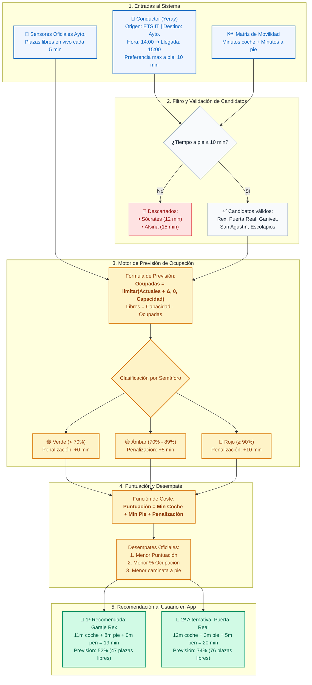

# 🚗 Diagramas Visuales de Granada Aparca

Este documento recoge los diagramas visuales del sistema para la memoria y presentación de entrega.

---

## 1. Diagrama de Flujo del Algoritmo de Previsión y Decisión

---

## 2. Diagrama de Arquitectura Tecnológica del Sistema

```mermaid
graph LR
    classDef layer fill:#FFFFFF,stroke:#CBD5E1,stroke-width:1px,color:#0F172A;
    classDef comp fill:#EFF6FF,stroke:#3B82F6,stroke-width:1.5px,color:#1E40AF;

    subgraph FUENTES ["Fuentes de Datos"]
        F1["Sensores CGIM Granada<br>(par_tabla.php)"]:::comp
        F2["Open Data Municipal<br>(KML Parkings / GIS)"]:::comp
        F3["Mapas / Tráfico Urbano<br>(Matriz ETSIIT - Centro)"]:::comp
    end

    subgraph INGESTA ["Ingesta y Normalización"]
        I1["Parser de Aforos<br>(fetch_real_data.js)"]:::comp
        I2["Validador de Frescura<br>(descarte &gt; 10 min)"]:::comp
    end

    subgraph MOTOR ["Motor de Negocio"]
        M1["Cálculo de Previsión (+15m / Horaria)"]:::comp
        M2["Semáforo de Agitación (+0 / +5 / +10m)"]:::comp
        M3["Ranking y Desempates"]:::comp
    end

    subgraph CLIENTE ["Frontend Web (SPA Vite + Bootstrap)"]
        C1["Pantalla Inicio<br>(Ruta + Mapa SVG + Tarjetas)"]:::comp
        C2["Pantalla Detalle<br>(Aforo en vivo vs Previsión)"]:::comp
        C3["Simulador Alertas<br>(Cambio de escenario)"]:::comp
    end

    FUENTES --> INGESTA
    INGESTA --> MOTOR
    MOTOR --> CLIENTE
```

---

> 💡 **Nota:** Se ha generado también un archivo SVG vectorial de alta resolución en [`entrega/diagrama_visual.svg`](file:///c:/Users/yerasito/Desktop/ldu/entrega/diagrama_visual.svg) listo para insertar en diapositivas, Figma o documentos impresos.
