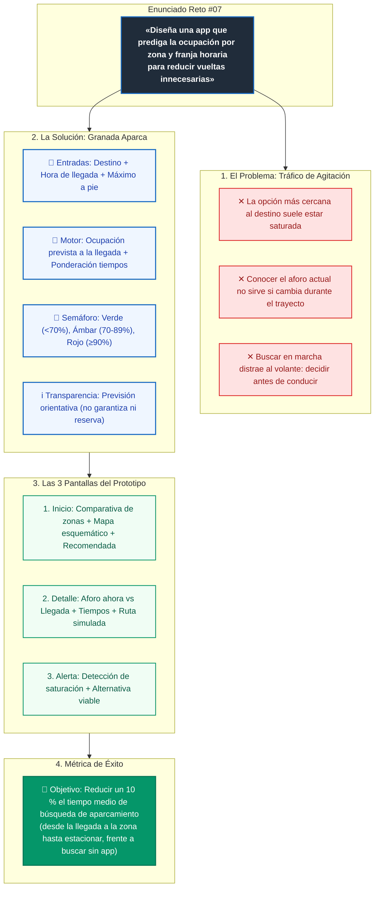

# Reto #07: Granada Aparca

**Enunciado:** Diseña una app que prediga la ocupación por zona y franja horaria para reducir vueltas innecesarias.

**Solución:** Granada Aparca

Granada Aparca es una aplicación conceptual que ayuda a elegir dónde aparcar antes de iniciar el trayecto. Compara zonas según la ocupación prevista a la hora de llegada, el tiempo de conducción y la distancia a pie, evitando que la opción más cercana sea siempre la elegida.

El usuario introduce su destino, la hora prevista de llegada y el máximo que acepta caminar. La aplicación recomienda una zona y ofrece alternativas mediante un semáforo de ocupación, mostrando plazas libres estimadas y aclarando que no reserva ni garantiza aparcamiento.

El prototipo interactivo presenta tres pantallas: inicio con comparación de zonas, detalle de la opción seleccionada y alerta con una alternativa. La demo simula un aumento de ocupación para mostrar cómo cambia la decisión. La previsión utiliza reglas transparentes; no se presenta como un modelo de inteligencia artificial validado.

**Métrica de éxito:** objetivo de reducir un 10 % el tiempo medio de búsqueda de aparcamiento, frente a buscar sin la aplicación, en pruebas con trayectos y franjas comparables. Se mide desde la llegada a la zona hasta estacionar. Es un objetivo pendiente de validación, no un resultado demostrado.

---

## 🎨 Diagrama Visual del Concepto

El diagrama vectorial completo se encuentra disponible en [`entrega/enunciado_solucion_granada_aparca.svg`](file:///c:/Users/yerasito/Desktop/ldu/entrega/enunciado_solucion_granada_aparca.svg).

